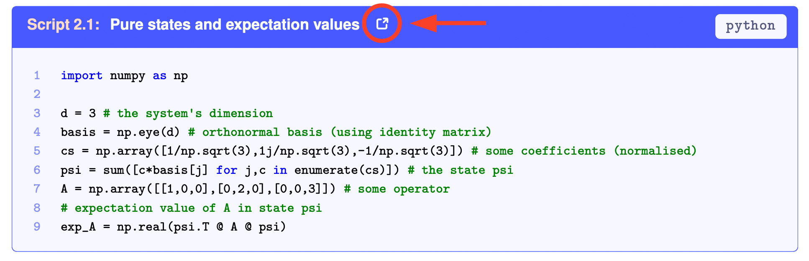

# A Tutorial on Quantum Master Equations
## Tips and tricks for quantum optics, quantum computing and beyond

*Wed, 29 Mar 2023, 10.48550/arXiv.2303.16449*

By Francesco Campaioli, Jared H. Cole, Harini Hapuarachchi

This is a collection of scripts and examples linked to the **tutorial** on quantum master equations, available at [arXiv:2303.16449](https://arxiv.org/abs/2303.16449). Please refer to the tutorial to navigate the content. Each example is linked to a script via the external link icon as below:

Please get in touch if you have any feedback!

### Abstract

Quantum master equations are an invaluable tool to model the dynamics of a plethora of microscopic systems, ranging from quantum optics and quantum information processing, to energy and charge transport, electronic and nuclear spin resonance, photochemistry, and more. This tutorial offers a concise and pedagogical introduction to quantum master equations, accessible to a broad, cross-disciplinary audience. The reader is guided through the basics of quantum dynamics with hands-on examples that build up in complexity. The tutorial covers essential methods like the Lindblad master equation, Redfield relaxation, and Floquet theory, as well as techniques like Suzuki-Trotter expansion and numerical approaches for sparse solvers. These methods are illustrated with code snippets implemented in Python and other languages, which can be used as a starting point for generalisation and more sophisticated implementations.

